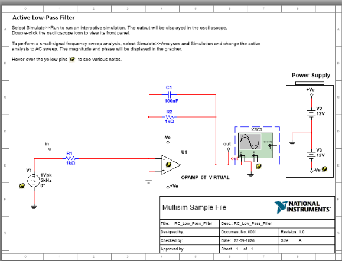
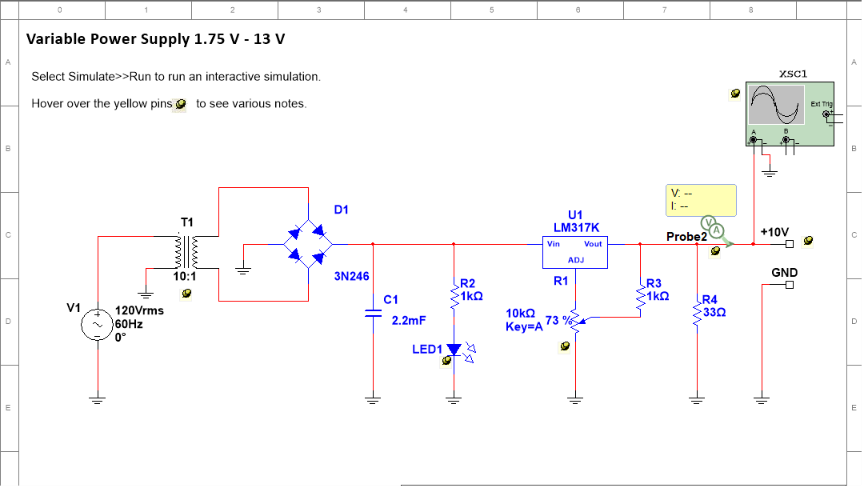
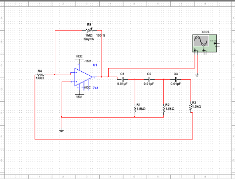

# NI Multisim Analog Electronics Laboratory Manual
## Complete Verified Experiments & Schematic Visual Portfolio

This manual documents the verified analog electronics laboratory experiments designed and simulated in **NI Multisim 14.1** using the Model Context Protocol (**multisim-mcp**).

---

## 📑 Table of Contents
1. [Experiment 1: Active First-Order Low-Pass Filter](#-experiment-1-active-first-order-low-pass-filter)
2. [Experiment 2: Variable Regulated DC Power Supply with Bridge Rectifier](#-experiment-2-variable-regulated-dc-power-supply-with-bridge-rectifier)
3. [Experiment 3: RC Phase Shift Audio Oscillator](#-experiment-3-rc-phase-shift-audio-oscillator)
4. [Experiment 4: Inverting Operational Amplifier (LM741)](#-experiment-4-inverting-operational-amplifier-lm741)
5. [Summary of Associated Multisim .MS14 Files](#-summary-of-associated-multisim-ms14-files)

---

## 🔬 Experiment 1: Active First-Order Low-Pass Filter

### Schematic in NI Multisim

### 1.1 Objective
To analyze the frequency response of an inverting **Active First-Order Low-Pass Filter** using a virtual 5-terminal operational amplifier, verify passband gain, and measure the $-3\,\text{dB}$ cutoff frequency.

### 1.2 Component & Parameter List
* **Operational Amplifier (`U1`)**: `OPAMP_5T_VIRTUAL` (5-terminal op-amp)
* **Input Resistor (`R1`)**: $1\,\text{k}\Omega$ ($1000\,\Omega$)
* **Feedback Resistor (`R2`)**: $1\,\text{k}\Omega$ ($1000\,\Omega$)
* **Feedback Capacitor (`C1`)**: $100\,\text{nF}$ ($0.1\,\mu\text{F}$)
* **Input Signal Source (`V1`)**: $1.0\,\text{V}_{pk}$ ($2.0\,\text{V}_{p-p}$), $5.0\,\text{kHz}, 0^\circ$
* **Dual Power Supplies**: $+V_e = +12.0\,\text{V}$, $-V_e = -12.0\,\text{V}$
* **Test Equipment**: 2-Channel Oscilloscope (`XSC1`)

### 1.3 Theoretical Formulations
* **Passband Gain ($A_{v0}$)**:
  $$A_{v0} = -\frac{R_2}{R_1} = -\frac{1\,\text{k}\Omega}{1\,\text{k}\Omega} = \mathbf{-1.0 \quad (0.0\,\text{dB})}$$
* **Cutoff Frequency ($f_c$)**:
  $$f_c = \frac{1}{2 \pi \cdot R_2 \cdot C_1} = \frac{1}{2 \pi \times 1000\,\Omega \times 100 \times 10^{-9}\,\text{F}} \approx \mathbf{1591.55\,\text{Hz} \text{ (~1.59 kHz)}}$$
* **High-Frequency Attenuation at 5 kHz**:
  $$|A_v(f)| = \frac{|A_{v0}|}{\sqrt{1 + \left(\frac{f}{f_c}\right)^2}} = \frac{1.0}{\sqrt{1 + \left(\frac{5000}{1591.55}\right)^2}} \approx \mathbf{0.303\,\text{V}_{pk} \quad (-10.36\,\text{dB})}$$

---

## ⚡ Experiment 2: Variable Regulated DC Power Supply with Bridge Rectifier

### Schematic in NI Multisim

### 2.1 Objective
To design and simulate a full **Linear Regulated Power Supply ($1.75\,\text{V}$ to $13.0\,\text{V}$)** utilizing a 10:1 step-down transformer, full-wave diode bridge, heavy capacitive smoothing filter ($2200\,\mu\text{F}$), and an LM317 adjustable positive voltage regulator under a $33\,\Omega$ load.

### 2.2 Component & Parameter List
* **AC Mains Input (`V1`)**: $120\,\text{V}_{rms} \text{ @ } 60\,\text{Hz}$ (or $230\,\text{V}_{rms} \text{ @ } 50\,\text{Hz}$)
* **Step-Down Transformer (`T1`)**: $10:1$ turns ratio
* **Bridge Rectifier (`D1`)**: `3N246` / `1B4B42` Silicon 4-Diode Bridge
* **Filter Capacitor (`C1`)**: $2.2\,\text{mF} = \mathbf{2200\,\mu\text{F}}$ Electrolytic, 50V
* **Power Indicator (`R2`, `LED1`)**: $1\,\text{k}\Omega$ current limiter with indicator LED
* **Voltage Regulator (`U1`)**: `LM317K` Adjustable Positive Linear Regulator
* **Adjustment Potentiometer (`R1`)**: $10\,\text{k}\Omega$ variable (Key=A, set to 73%)
* **Setting Resistor (`R3`)**: $1\,\text{k}\Omega$ (or $240\,\Omega$)
* **Output Load Resistor (`R4`)**: $\mathbf{33\,\Omega}$ power load resistor
* **Test Equipment**: Dual-trace Oscilloscope (`XSC1`), Multimeter / Voltage-Current Probe (`Probe2`)

### 2.3 Theoretical Formulations
* **Secondary AC Voltage**:
  $$V_{s,rms} = \frac{V_{pri,rms}}{10} = \mathbf{12.0\,\text{V}_{rms}} \quad (V_{s,pk} = 12 \times \sqrt{2} \approx 16.97\,\text{V})$$
* **Filtered Unregulated DC Rail on $C_1$**:
  $$V_{dc(in)} \approx V_{s,pk} - 2 V_D \approx 16.97\,\text{V} - 1.76\,\text{V} \approx \mathbf{15.21\,\text{V}}$$
* **LM317 Regulated Output Voltage**:
  $$V_{out} = V_{ref} \left(1 + \frac{R_{adj}}{R_3}\right) + I_{adj} R_{adj}$$
  With $V_{ref} = 1.25\,\text{V}$ and $R_1$ adjusted:
  $$V_{out} \approx 1.25\text{ V} \times \left(1 + \frac{7.3\,\text{k}\Omega}{1\,\text{k}\Omega}\right) \approx \mathbf{10.37\,\text{V} \text{ (~10 V Rail)}}$$
* **Load Current through $33\,\Omega$**:
  $$I_L = \frac{V_{out}}{R_L} = \frac{10.37\,\text{V}}{33\,\Omega} \approx \mathbf{314\,\text{mA}}$$

---

## 🔄 Experiment 3: RC Phase Shift Audio Oscillator

### Schematic in NI Multisim

### 3.1 Objective
To construct and observe sustained sinusoidal oscillations using an operational amplifier with a 3-stage $RC$ feedback ladder network, and verify the oscillation frequency against the Barkhausen criterion.

### 3.2 Component & Parameter List
* **Operational Amplifier (`U1`)**: `LM741` General-Purpose Op-Amp
* **Dual Power Supplies**: $V_{CC} = +15.0\,\text{V}$, $V_{EE} = -15.0\,\text{V}$
* **Three-Stage Phase Shift Ladder**:
  * Capacitors: $C_1 = C_2 = C_3 = \mathbf{0.01\,\mu\text{F}}$
  * Resistors: $R_1 = R_2 = R_3 = \mathbf{1.5\,\text{k}\Omega}$
* **Inverting Gain Stage**:
  * Input Resistor (`R4`): $15\,\text{k}\Omega$
  * Feedback Potentiometer (`R5`): $1\,\text{M}\Omega$ (Adjustable feedback gain)
* **Test Equipment**: Oscilloscope (`XSC1`)

### 3.3 Theoretical Formulations
* **Barkhausen Criterion**:
  1. Loop gain $|A \cdot \beta| = 1$
  2. Total loop phase shift = $360^\circ$ ($0^\circ$).
* The inverting op-amp provides a **$180^\circ$ phase shift**.
* Each of the three $RC$ sections contributes an average of **$60^\circ$ phase shift**, totaling **$180^\circ$** at the resonant frequency $f_0$.
* **Theoretical Frequency of Oscillation ($f_0$)**:
  $$f_0 = \frac{1}{2 \pi R C \sqrt{6}} = \frac{1}{2 \pi \times 1500\,\Omega \times 0.01 \times 10^{-6}\,\text{F} \times \sqrt{6}}$$
  $$f_0 = \frac{1}{2 \pi \times 1.5 \times 10^{-5} \times 2.4495} \approx \mathbf{4331.8\,\text{Hz} \text{ (~4.33 kHz)}}$$
* **Required Amplifier Gain**:
  $$\beta = \frac{1}{29} \implies |A_v| \ge 29 \implies \frac{R_5}{R_4} \ge 29 \implies R_5 \ge 29 \times 15\,\text{k}\Omega = \mathbf{435\,\text{k}\Omega}$$

---

## 📈 Experiment 4: Inverting Operational Amplifier (LM741)

### Schematic in NI Multisim

### 4.1 Objective
To verify the inverting amplification characteristics, closed-loop gain, virtual ground concept, and $180^\circ$ phase reversal using an industry-standard LM741 operational amplifier.

### 4.2 Component & Parameter List
* **Operational Amplifier (`U1`)**: `LM741` Operational Amplifier
* **Dual DC Rails**: $V_{CC} = +12.0\,\text{V}$, $V_{EE} = -12.0\,\text{V}$
* **Input Resistor (`R1`)**: $10\,\text{k}\Omega$
* **Feedback Resistor (`R2`)**: $100\,\text{k}\Omega$
* **AC Input Source (`V1`)**: $2.0\,\text{V}_{pk}$ ($4.0\,\text{V}_{p-p}$), $1.0\,\text{kHz}, 0^\circ$
* **Test Equipment**: 2-Channel Oscilloscope (`XSC1`)

### 4.3 Theoretical Formulations
* **Closed-Loop Voltage Gain ($A_v$)**:
  $$A_v = -\frac{R_2}{R_1} = -\frac{100\,\text{k}\Omega}{10\,\text{k}\Omega} = \mathbf{-10.0 \quad (+20.0\,\text{dB})}$$
* **Phase Relationship**: Output is inverted by **$180^\circ$** with respect to the input signal.
* **Virtual Ground**: The inverting input node ($V_-$) sits at approximately $0\,\text{V}$ due to the negative feedback loop and high open-loop gain ($A_{OL} \approx 200,000$).

---

## 💾 Summary of Associated Multisim .MS14 Files & Reports

All circuits are preserved strictly in native **`.ms14`** schematic files alongside comprehensive **`.md`** laboratory reports:

| Experiment Title | Native Multisim Schematic | Lab Experiment Report |
| :--- | :--- | :--- |
| **Active Low-Pass Filter** | [`experiments/RC_Low_Pass_Filter.ms14`](experiments/RC_Low_Pass_Filter.ms14) | [`RC_FILTER_EXPERIMENT_REPORT.md`](experiments/RC_FILTER_EXPERIMENT_REPORT.md) |
| **Variable Regulated DC Power Supply** | [`experiments/variable_power_supply_bridge_rectifier.ms14`](experiments/variable_power_supply_bridge_rectifier.ms14) | [`BRIDGE_RECTIFIER_EXPERIMENT_REPORT.md`](experiments/BRIDGE_RECTIFIER_EXPERIMENT_REPORT.md) |
| **RC Phase Shift Audio Oscillator** | [`experiments/rc_phase_shift_oscillator.ms14`](experiments/rc_phase_shift_oscillator.ms14) | [`RC_PHASE_SHIFT_OSCILLATOR_EXPERIMENT_REPORT.md`](experiments/RC_PHASE_SHIFT_OSCILLATOR_EXPERIMENT_REPORT.md) |
| **Inverting Operational Amplifier** | [`experiments/opamp_inverting_amplifier.ms14`](experiments/opamp_inverting_amplifier.ms14) | [`OPAMP_INVERTING_AMPLIFIER_EXPERIMENT_REPORT.md`](experiments/OPAMP_INVERTING_AMPLIFIER_EXPERIMENT_REPORT.md) |
| **Full-Wave Bridge Rectifier (Native)** | [`experiments/bridge_rectifier.ms14`](experiments/bridge_rectifier.ms14) | [`BRIDGE_RECTIFIER_EXPERIMENT_REPORT.md`](experiments/BRIDGE_RECTIFIER_EXPERIMENT_REPORT.md) |
| **BJT Common Emitter Amplifier** | [`experiments/bjt_ce_amplifier.ms14`](experiments/bjt_ce_amplifier.ms14) | [`BJT_CE_AMPLIFIER_EXPERIMENT_REPORT.md`](experiments/BJT_CE_AMPLIFIER_EXPERIMENT_REPORT.md) |

*(Strictly adhering to project standards: Only native `.ms14` schematics and markdown `.md` reports are committed).*

