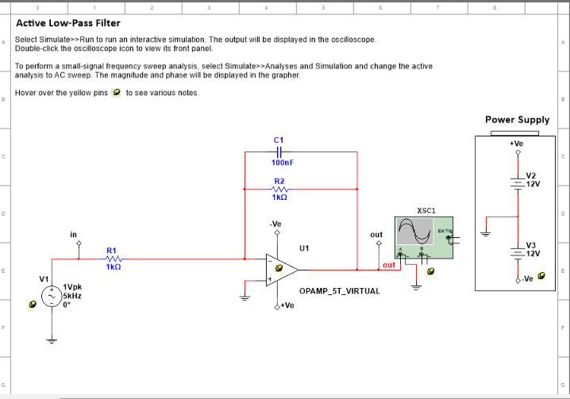

# NI Multisim 14.1 Automation via MCP

Comprehensive guide for integrating and automating **National Instruments Multisim 14.1** using the Model Context Protocol (**multisim-mcp**) and the Antigravity AI agent.

---

## 📋 Table of Contents
1. [Overview](#-overview)
2. [Prerequisites & System Architecture](#-prerequisites--system-architecture)
3. [Step-by-Step Installation & Setup Commands](#-step-by-step-installation--setup-commands)
4. [Diagnostics & COM Verification](#-diagnostics--com-verification)
5. [Antigravity Client Configuration](#-antigravity-client-configuration)
6. [How It Works](#-how-it-works)
7. [Prompting & Usage Guide](#-prompting--usage-guide)
8. [Verified Test Project: 1 Hz Blinking LED](#-verified-test-project-1-hz-blinking-led)
9. [Available MCP Tools Overview](#-available-mcp-tools-overview)
10. [Pushing to GitHub](#-pushing-to-github)

---

## 🔭 Overview

`multisim-mcp` is an open-source MCP (Model Context Protocol) server that exposes NI Multisim 14.1 COM Automation APIs directly to AI agents. It enables:
- Programmatic circuit design, modification, and schematic inspection.
- Execution of DC Operating Point, AC Frequency Sweep, and Transient simulations.
- Direct measurement extraction (voltages, branch currents, multimeter probes, Bode plots).
- Batch parametric sweeps and automated technical reporting.



---

## ⚙ Prerequisites & System Architecture

| Component | Specification | Notes |
| :--- | :--- | :--- |
| **Operating System** | Windows 11 (64-bit) | Multisim COM is Windows-native |
| **Multisim Version** | NI Multisim 14.1 (32-bit) | Located in `Program Files (x86)\National Instruments` |
| **Python Worker** | Python 3.14 (32-bit) | **Required**: COM libraries requires a 32-bit Python runtime |
| **MCP Wrapper** | `multisim-mcp==1.1.0` | Provides the stdio MCP server & diagnostic CLI |
| **Client** | Antigravity AI IDE | Automatically manages MCP stdio lifecycle |

---

## 🛠 Step-by-Step Installation & Setup Commands

All setup steps were executed from the Windows terminal (PowerShell):

### 1. Locate 32-bit Python Installation
NI Multisim's COM Automation interface requires a 32-bit architecture to interface with its 32-bit DLLs and COM objects:
```powershell
# List available Python installations
py --list

# Verify the 32-bit Python path and bitness
py -3.14-32 -c "import sys; print(sys.executable); print('Is 64-bit:', sys.maxsize > 2**32)"
```
* **Detected Path**: `C:\Program Files (x86)\Python314-32\python.exe`

---

### 2. Install Dependencies
Install `multisim-mcp` version 1.1.0 into the 32-bit Python environment:
```powershell
& "C:\Program Files (x86)\Python314-32\python.exe" -m pip install "multisim-mcp==1.1.0"
```
> **Note on Permissions**: Since `C:\Program Files (x86)` requires administrative elevation, pip automatically placed user scripts and binaries into:
> `C:\Users\<User>\AppData\Roaming\Python\Python314-32\Scripts`

---

### 3. Run Diagnostic Handshake
Execute the diagnostic tool to test COM registration and live Multisim activation:
```powershell
& "$env:APPDATA\Python\Python314-32\Scripts\multisim-mcp.exe" --json doctor --connect
```

**Diagnostic Results:**
- **Python Architecture**: 32-bit (Passed)
- **COM Registration**: Found `MultisimInterface.MultisimApp` (`{D9CBB7A1-6AD6-438B-AD1B-42FB2DB00CAE}`)
- **Live Connection**: Connected to `C:\Program Files (x86)\National Instruments\Circuit Design Suite 14.1\Multisim.exe`
- **Simulation Engine**: Ready (`automation_ready: true`)

---

### 4. Generate Client Configuration
Generate the generic MCP JSON fragment targeting the 32-bit Python executable:
```powershell
& "$env:APPDATA\Python\Python314-32\Scripts\multisim-mcp.exe" config --client generic --python "C:\Program Files (x86)\Python314-32\python.exe"
```

Generated block:
```json
{
  "command": "C:\\Program Files (x86)\\Python314-32\\python.exe",
  "args": [
    "-m",
    "multisim_mcp.server"
  ]
}
```

---

### 5. Inject MCP Configuration
Add the configuration block under `"multisim"` in Antigravity's MCP configuration:
- Global path: `~/.gemini/config/mcp_config.json`
- User path: `~/.gemini/antigravity/mcp_config.json`

```json
{
  "mcpServers": {
    "multisim": {
      "command": "C:\\Program Files (x86)\\Python314-32\\python.exe",
      "args": [
        "-m",
        "multisim_mcp.server"
      ]
    }
  }
}
```

---

## 🚀 How It Works

1. **Zero Manual Server Startup**: You do **not** need to keep a terminal open or run `multisim-mcp serve`.
2. **On-Demand Lifecycle**: Antigravity automatically launches the server process in the background whenever you ask questions or issue tasks related to Multisim circuits.
3. **Global Availability**: Because the configuration is in `~/.gemini/config/mcp_config.json`, the tools are accessible across all workspaces.

---

## 💬 Prompting & Usage Guide

Once configured, you can interact with Multisim using natural language prompts:

### Circuit Inspection & Editing
- *"Connect to Multisim and open the circuit file at `C:\Circuits\AudioAmp.ms14`."*
- *"List all components, nets, and input/output pins in the active schematic."*
- *"Change resistor R1 to 10k ohms and capacitor C1 to 100nF."*

### Simulation & Analysis
- *"Run a DC operating point analysis and show the nodal voltages."*
- *"Run an AC frequency sweep from 10 Hz to 100 kHz on net `Vout` and report the -3dB cutoff frequency."*
- *"Run a 10ms transient simulation with a 1µs time step and report peak voltages."*
- *"Read the virtual multimeter value on net 3."*

### Batch Sweeps & Reports
- *"Run a parameter sweep for resistor R1 across [1k, 4.7k, 10k] and evaluate rise time."*
- *"Export the formal experiment report with waveform CSV data."*

---

## 💡 Verified Test Project: 1 Hz Blinking LED

To test the integration end-to-end, we performed a live transient simulation of an LED flasher circuit through Multisim's SPICE engine.

### Circuit SPICE Netlist
```spice
* LED Blinking Circuit (1 Hz Pulse)
V1 1 0 PULSE(0 5 0 1m 1m 0.5 1.0)
R1 1 2 330
D1 2 0 DLED
.model DLED D(Is=1e-22 Rs=5 N=1.8 Cjo=20p)
.end
```

### Multisim Command
```spice
tran 10m 2.0
```

### Verified Simulation Output
- **Pulse Generator `V(1)`**: Successfully pulsed between `0.0 V` and `5.0 V` (500 ms ON, 500 ms OFF).
- **LED Anode `V(2)`**: Reached **2.18 V** forward voltage drop when active.
- **Current through LED**: Peak current measured at **8.55 mA**, within safe continuous ratings for standard indicator LEDs.
- **Waveform Data**: Automatically logged to local CSV for further plotting and analysis.

---

## 🧰 Available MCP Tools Overview

The `multisim-mcp` integration registers **55 tools** categorized into:

1. **Connection & State**: `connect`, `disconnect`, `runtime_status`, `circuit_info`
2. **Circuit Management**: `new_circuit`, `open_circuit`, `save_circuit`, `get_circuit_image`
3. **Netlist & Components**: `report_netlist`, `report_bom`, `enum_components`, `get_rlc_value`, `set_rlc_value`
4. **Simulation Engines**:
   - `run_dc_operating_point`
   - `run_ac_sweep`, `run_ac_single_frequency`
   - `run_transient`, `stop_simulation`
   - `run_spice_netlist`
5. **Virtual Instruments & Diagnostics**:
   - `read_virtual_multimeter`
   - `analyze_bode_response`
   - `analyze_logic_signals`
6. **Automation & Reporting**:
   - `run_circuit_experiment`, `run_verified_circuit_experiment`
   - `plan_experiment_sweep`, `run_experiment_sweep`
   - `generate_report`, `export_formal_experiment_report`

---

## 📦 Pushing to GitHub

To push this project and documentation to GitHub:

### 1. Initialize Git & Add Files
```powershell
# Open the project folder in PowerShell
cd "c:\ni multisim sutomation"

# Initialize Git repository
git init

# Add README and gitignore
git add README.md .gitignore

# Make the initial commit
git commit -m "Initial commit: NI Multisim 14.1 MCP automation setup and documentation"
```

### 2. Connect to Your GitHub Repository
Create a new empty repository on [GitHub](https://github.com/new), then link and push:
```powershell
# Set branch name to main
git branch -M main

# Add remote origin (replace with your actual repository URL)
git remote add origin https://github.com/<YOUR-USERNAME>/<YOUR-REPO-NAME>.git

# Push to GitHub
git push -u origin main
```
